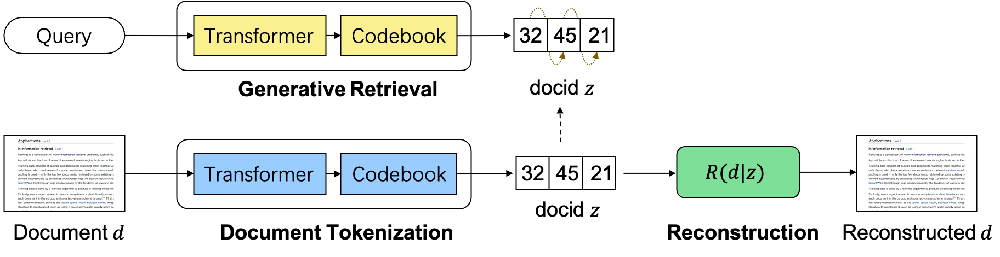

# Learning to Tokenize for Generative Retrieval

Code of the paper [Learning to Tokenize for Generative Retrieval](https://openreview.net/pdf?id=UKd6dpVGdu).



## Environment
pytorch, transformers, accelerate, faiss, k_means_constrained

## Dataset
NQ320K: unzip `dataset/nq320k.zip` 

Other datasets coming soon.

## Training and Evaluation
Code for GenRet on NQ320K:
```bash
python run.py --model_name t5-base --code_num 512 --max_length 3 --train_data dataset/nq320k/train.json --dev_data dataset/nq320k/dev.json --corpus_data dataset/nq320k/corpus_lite.json --save_path out/model
```


Code for generative retrieval baselines: `baseline.py`

Code for dense retrieval baselines: `dpr.py`

## Cite
```
@article{Sun2023LearningTT,
  title={Learning to Tokenize for Generative Retrieval},
  author={Weiwei Sun and Lingyong Yan and Zheng Chen and Shuaiqiang Wang and Haichao Zhu and Pengjie Ren and Zhumin Chen and Dawei Yin and M. de Rijke and Zhaochun Ren},
  journal={ArXiv},
  year={2023},
  volume={abs/2304.04171},
}
```


